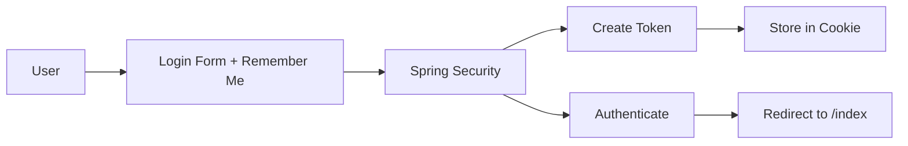
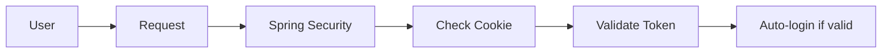

# Remember Me Authentication in Spring Security

## Overview
The "Remember Me" functionality in Spring Security allows users to maintain their authenticated session across browser restarts. This document explains how it works in our chess application.

## Implementation

### Configuration in SecurityConfig
```java
.rememberMe(remember -> {
    remember
        .key("uniqueAndSecretKey")        // Secret key for token generation
        .tokenValiditySeconds(864000)       // 24 hours validity
        .rememberMeParameter("remember")   // Form checkbox name
        .rememberMeCookieName("remember-me-cookie");
})
```

### HTML Form Implementation
```html
<div class="remember-me">
    <input type="checkbox" id="remember" name="remember">
    <label for="remember">Remember Me</label>
</div>
```

## How It Works

### 1. Token Creation
When a user logs in with "Remember Me" checked:
- Spring Security generates a token using:
  ```
  username + expirationTime + MD5Hex(username + expirationTime + password + key)
  ```
- The token includes:
  - Username
  - Expiration timestamp
  - MD5 hash of the above plus password and secret key

### 2. Token Storage
- Token is stored in a cookie named "remember-me-cookie"
- Cookie persists even after browser closure
- Cookie includes expiration time (24 hours from creation)

### 3. Token Validation Process
On subsequent visits:
1. Spring Security checks for remember-me cookie
2. Extracts username and expiration time
3. Recomputes MD5 hash
4. Validates token authenticity
5. Checks expiration time
6. Auto-logs in user if all checks pass

### 4. Security Measures
Token invalidation occurs when:
- User explicitly logs out
- Token expires (24 hours)
- User's password changes
- Cookie is deleted

```java
.logout(logout -> {
    logout
        .logoutSuccessUrl("/login?logout")
        .deleteCookies("remember-me-cookie")
        .permitAll();
})
```

## Authentication Flow

### Initial Login


### Subsequent Visits


## Security Recommendations for Production

### 1. Strong Secret Key
Replace `uniqueAndSecretKey` with a strong random value:
- Use a cryptographically secure random generator
- Store in environment variables or secure configuration
- Minimum 256 bits length recommended

### 2. Database Token Storage
Implement `PersistentTokenBasedRememberMeServices`:
- Stores tokens in database
- Allows token revocation
- Provides audit trail
- Better security than cookie-based storage

### 3. Token Validity Period
Adjust based on security requirements:
- Shorter periods for sensitive applications
- Consider user experience vs security trade-off
- Implement token rotation for long-term persistence

### 4. Additional Security Measures
- Implement IP address validation
- Add user agent verification
- Enable secure cookie attributes
- Implement token refresh mechanism

## Troubleshooting

### Common Issues
1. Token not persisting:
   - Check cookie settings
   - Verify remember-me parameter name
   - Check secure cookie settings

2. Premature token expiration:
   - Verify tokenValiditySeconds setting
   - Check server time synchronization
   - Review cookie security policies

3. Authentication failures:
   - Validate secret key configuration
   - Check user password changes
   - Review token validation logs 